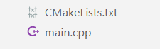
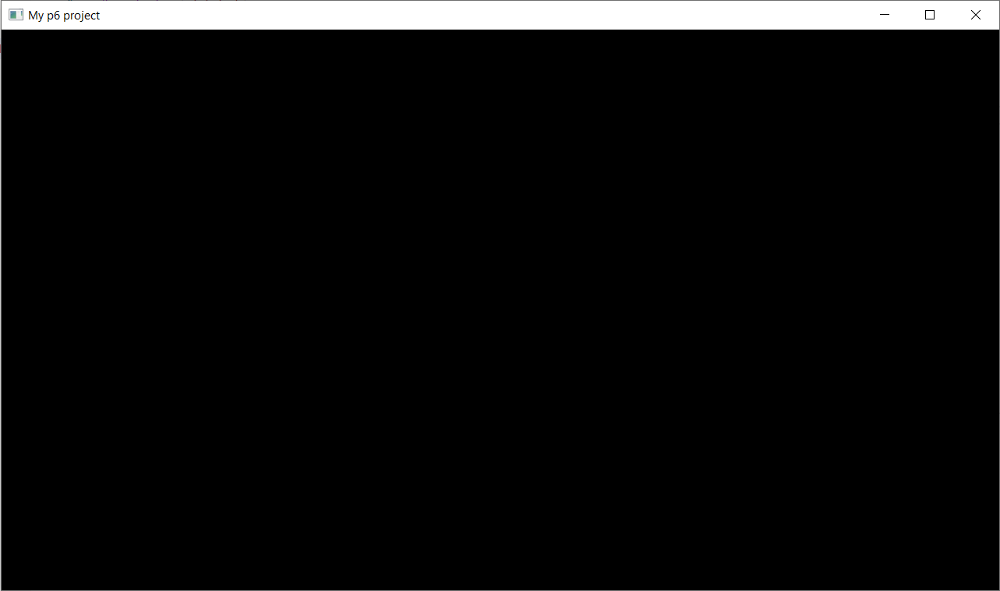

## Structure

Here is the minimal project structure that you need to have:<br/>


## CMakeLists.txt

```cmake title="CMakeLists.txt"
cmake_minimum_required(VERSION 3.8)
project(my-p6-project)

add_executable(${PROJECT_NAME} main.cpp)
target_compile_features(${PROJECT_NAME} PRIVATE cxx_std_17)

# ---Add p6---
add_subdirectory(p6)
target_link_p6_library(${PROJECT_NAME}) # We don't use the usual target_link_libraries() because p6 needs some additional setup
```

## main.cpp

```cpp title="main.cpp"
#include <p6/p6.h>

int main()
{
    auto ctx = p6::Context{{1280, 720, "My p6 project"}}; // Create a context with a window
    ctx.start();                                          // Start the p6 application
}
```

## p6

To get the p6 folder, open a terminal at the root of your project and run:
```
git clone --recursive https://github.com/JulesFouchy/p6
```

Or, if you have already setup a *git* repository for your project, you can add p6 as a submodule instead:
```
git submodule add https://github.com/JulesFouchy/p6
git submodule update --init --recursive
```
(To learn about Git submodules, check out [this lesson](https://julesfouchy.github.io/Learn--Clean-Code-With-Cpp/lessons/git-submodules/)).

:::tip
You can always compare with [the basic example](https://github.com/JulesFouchy/p6-docs/tree/main/examples/basic) if something is not quite working for you.
:::

## Conclusion

If everything went well you should be able to run your project and see this window:



Congrats :tada: You can now start using *p6* to build amazing artworks, interactive experiences and games!