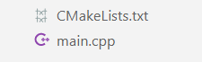
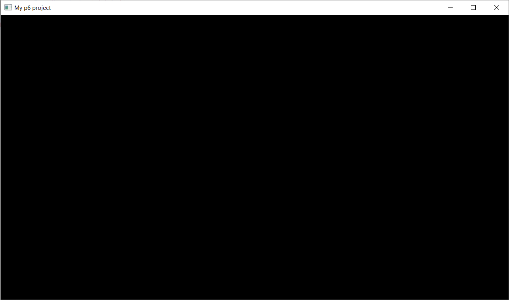

## Structure

Here is the minimal project structure that you need to have:<br/>


## CMakeLists.txt

```cmake title="CMakeLists.txt"
cmake_minimum_required(VERSION 3.20)
project(my-p6-project)

add_executable(${PROJECT_NAME} main.cpp)
target_compile_features(${PROJECT_NAME} PRIVATE cxx_std_17)

# ---Download and link p6---
include(FetchContent)
FetchContent_Declare(
    p6
    GIT_REPOSITORY https://github.com/julesfouchy/p6
    GIT_TAG bec1ef40b497106a4a2539d9b10a199500bdc96c
)
FetchContent_MakeAvailable(p6)
target_link_libraries(${PROJECT_NAME} p6::p6)
```

## main.cpp

```cpp title="main.cpp"
#include <p6/p6.h>

int main()
{
    auto ctx = p6::Context{{1280, 720, "My p6 project"}}; // Create a context with a window
    ctx.start();                                          // Start the p6 application
}
```

## Conclusion

If everything went well you should be able to run your project and see this window:



:::info Congrats 🎉
You can now start using *p6* to build amazing artworks, interactive experiences and games!
:::
