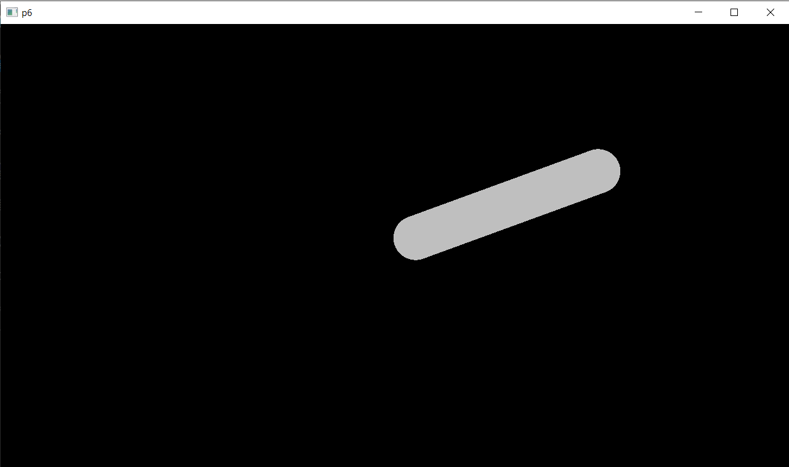

You can use these functions on the `Context` at any time, even outside of the `update` function.

## `background()`

`background()` clears the whole canvas with one solid color. It is very useful if you want to do animations and don't want the drawings of the previous frames to remain on your canvas.<br/>
On the other hand not using `background()` can give you very cool effects.

```cpp
ctx.update = [&]() {
    ctx.background({0.2f, 0.1f, 0.3f}); // Comment out this line for an interesting effect
    ctx.circle(p6::Center{ctx.mouse()}, p6::Radius{0.3f});
};
```

And if you want your drawings to slowly fade away, draw a partially transparent rectangle instead of using `background()`:

```cpp
ctx.update = [&]() {
    // Clear the background with a fading effect
    ctx.use_stroke = false;
    ctx.fill       = {0.2f, 0.1f, 0.3f, 0.1f};
    ctx.rectangle(p6::FullScreen{});
    // Draw something
    ctx.fill = {1.f, 0.7f, 0.2f};
    ctx.circle(p6::Center{ctx.mouse()}, p6::Radius{0.3f});
};
```

## Shapes

`circle()`, `ellipse()`, `square()`, `rectangle()` and `triangle()` have many overloads. Go to [the reference](../reference/drawing) to learn all about them.

```cpp
#include <p6/p6.h>

int main()
{
    auto      ctx      = p6::Context{};
    p6::Angle rotation = 0.011_turn;
    ctx.mouse_scrolled = [&](p6::MouseScroll e) {
        rotation += e.dy * 0.025_turn;
    };
    ctx.update = [&]() {
        ctx.background({});
        ctx.stroke = {1, 1, 1, 1};
        // White square positioned by Center
        ctx.square(p6::Center{ctx.mouse()},
                   p6::Radius{0.3f},
                   p6::Rotation{rotation});
        // Red square positioned by Top Left Corner
        ctx.fill = {1, 0, 0, 0.5};
        ctx.square(p6::TopLeftCorner{ctx.mouse()},
                   p6::Radius{0.3f},
                   p6::Rotation{rotation});
        // Green square positioned by Top Right Corner
        ctx.fill = {0, 1, 0, 0.5};
        ctx.square(p6::TopRightCorner{ctx.mouse()},
                   p6::Radius{0.3f},
                   p6::Rotation{rotation});
        // Blue square positioned by Bottom Left Corner
        ctx.fill = {0, 0, 1, 0.5};
        ctx.square(p6::BottomLeftCorner{ctx.mouse()},
                   p6::Radius{0.3f},
                   p6::Rotation{rotation});
        // Cyan square positioned by Bottom Right Corner
        ctx.fill = {0, 1, 1, 0.5};
        ctx.square(p6::BottomRightCorner{ctx.mouse()},
                   p6::Radius{0.3f},
                   p6::Rotation{rotation});
    };
    ctx.start();
}
```

## Colors

Colors are expressed as RGBA, with each value going from 0.0 to 1.0:

```cpp
p6::Color color{1.f, 0.7f, 0.2f}; // A nice orange.
                                  // If you don't specify the fourth value (alpha, the opacity) it will be defaulted to 1.0
```

Shapes have two colors: the `fill` and the `stroke`.
- The `fill` controls the "main" color of the shape
- The `stroke` adds a second color on the edges of the shape. The size of that edge is controlled by `stroke_weight`.

Both the fill and the stroke can be disabled with `ctx.use_fill = false;` and `ctx.use_stroke = false;`.

```cpp
#include <p6/p6.h>

int main()
{
    auto ctx          = p6::Context{};
    ctx.fill          = {1, 1, 1}; // White
    ctx.stroke        = {0, 0, 0}; // Black
    ctx.stroke_weight = 0.1f;
    ctx.background({0, 1, 1}); // Cyan

    ctx.use_fill   = true;
    ctx.use_stroke = true;
    ctx.circle(p6::Center{-0.5f, 0.5f}, p6::Radius{0.5f});
    ctx.use_fill   = false;
    ctx.use_stroke = true;
    ctx.circle(p6::Center{0.5f, 0.5f}, p6::Radius{0.5f});
    ctx.use_fill   = true;
    ctx.use_stroke = false;
    ctx.circle(p6::Center{-0.5f, -0.5f}, p6::Radius{0.5f});

    ctx.start();
}
```

## Line

[`ctx.line()`](../reference/drawing#line) is a bit of a special shape: it has only one color which is the `stroke` color, and its thickness is controlled by `stroke_weight`:

```cpp
#include <p6/p6.h>

int main()
{
    auto ctx   = p6::Context{};
    ctx.update = [&]() {
        ctx.background({});
        ctx.stroke        = p6::Color{1.f, 1.f, 1.f, 0.75f};
        ctx.stroke_weight = 0.1f;
        ctx.line(glm::vec2{0.f}, ctx.mouse());
    };
    ctx.start();
}
```

