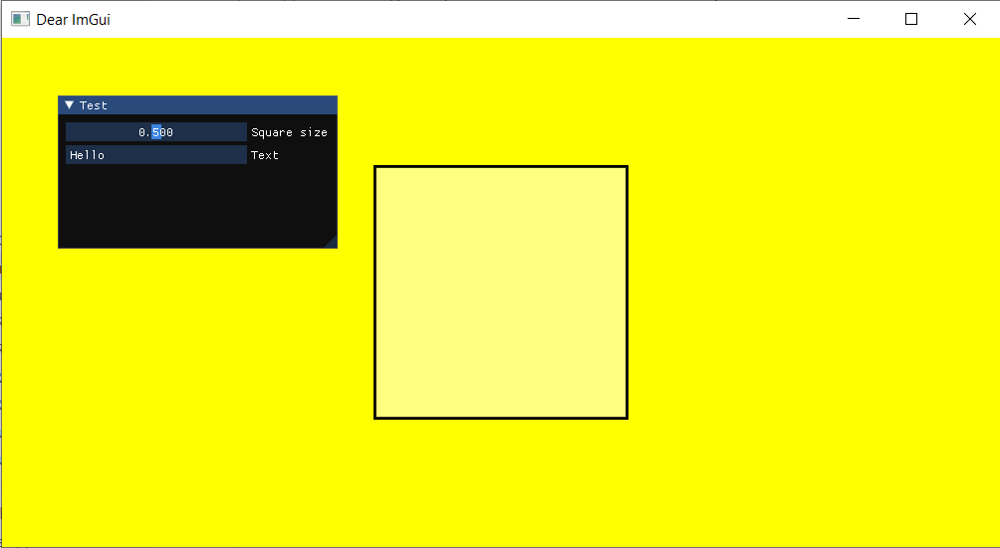
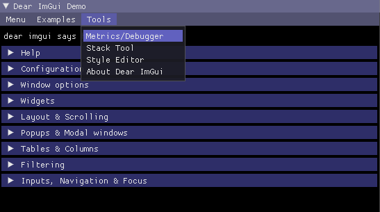
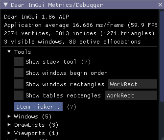
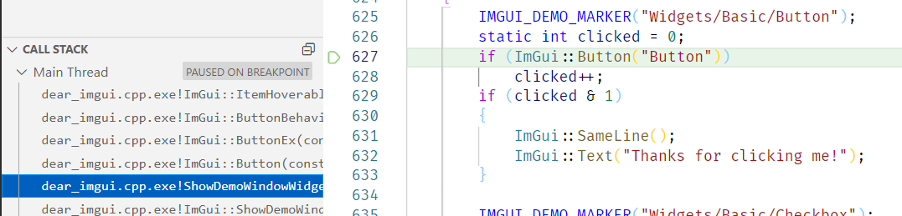

[*Dear ImGui*](https://github.com/ocornut/imgui) is a very popular and easy-to-use GUI library.<br/>
It is integrated into *p6* and you can use it without any additional setup.



## Using *Dear ImGui*

You simply have to render all your ImGui windows inside the `ctx.update()` function:

```cpp
#include <p6/p6.h>

int main()
{
    auto        ctx           = p6::Context{{1280, 720, "Dear ImGui"}};
    auto        square_radius = 0.5f;
    std::string text          = "Hello";
    ctx.update = [&]() {
        // Show a simple window
        ImGui::Begin("Test");
        ImGui::SliderFloat("Square size", &square_radius, 0.f, 1.f);
        ImGui::InputText("Text", &text);
        ImGui::End();
        // Show the official ImGui demo window
        // It is very useful to discover all the widgets available in ImGui
        ImGui::ShowDemoWindow();

        ctx.background({1, 1, 0, 1});
        ctx.square(p6::Center{}, p6::Radius{square_radius});
    };
    ctx.start();
}
```

Note that if you want your code to be a bit more structured, you can also put your ImGui code in the `ctx.imgui()` function:

```cpp
#include <p6/p6.h>

int main()
{
    auto        ctx           = p6::Context{{1280, 720, "Dear ImGui"}};
    auto        square_radius = 0.5f;
    std::string text          = "Hello";
    ctx.imgui                 = [&]() {
        // Show a simple window
        ImGui::Begin("Test");
        ImGui::SliderFloat("Square size", &square_radius, 0.f, 1.f);
        ImGui::InputText("Text", &text);
        ImGui::End();
        // Show the official ImGui demo window
        // It is very useful to discover all the widgets available in ImGui
        ImGui::ShowDemoWindow();
    };
    ctx.update = [&]() {
        ctx.background({1, 1, 0, 1});
        ctx.square(p6::Center{}, p6::Radius{square_radius});
    };
    ctx.start();
}
```

## Learning *Dear ImGui*

[Here is *Dear ImGui*'s GitHub](https://github.com/ocornut/imgui)

:::tip
*Dear ImGui* doesn't have an official documentation, but you can look at their demo window to see all the available widgets. To open it simply call `ImGui::ShowDemoWindow();` inside `ctx.imgui`.<br/>
And if you want to see the associated code, open *Tools->Metrics/Debugger* and then choose the *Item Picker*: it will allow you to click on any widget and have your IDE take you to the code that created it. (NB: you might have to go up in the callstack a little bit).




:::